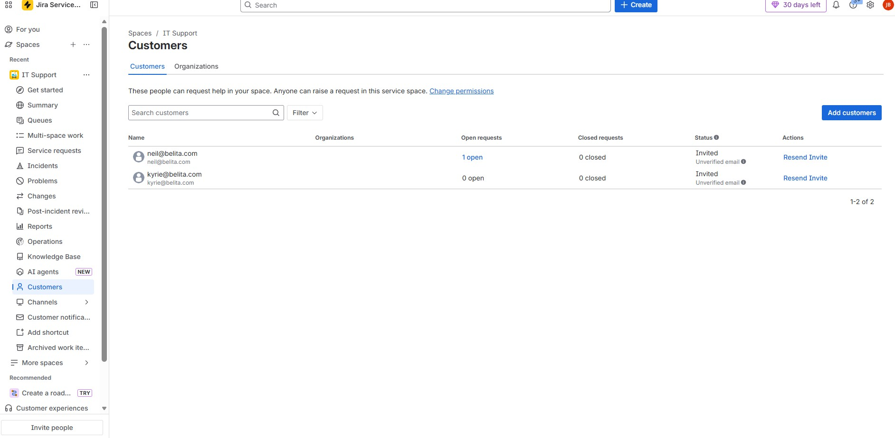
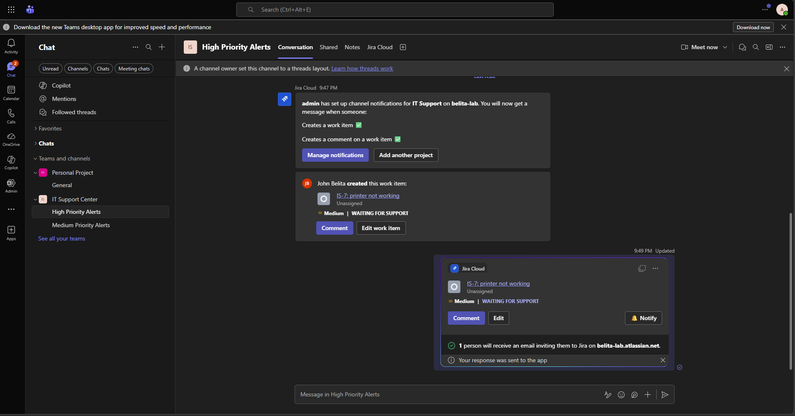
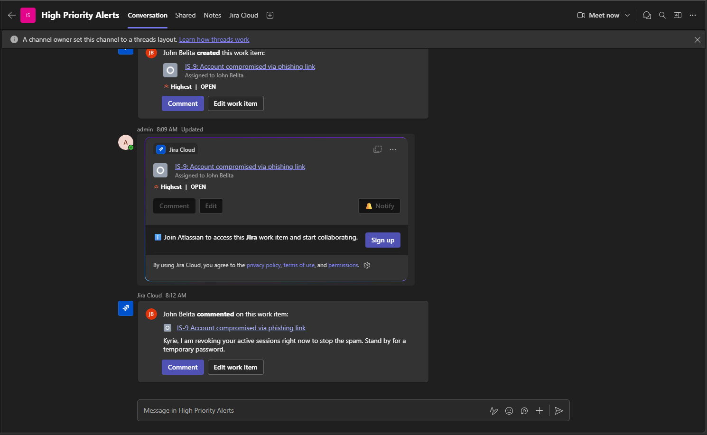
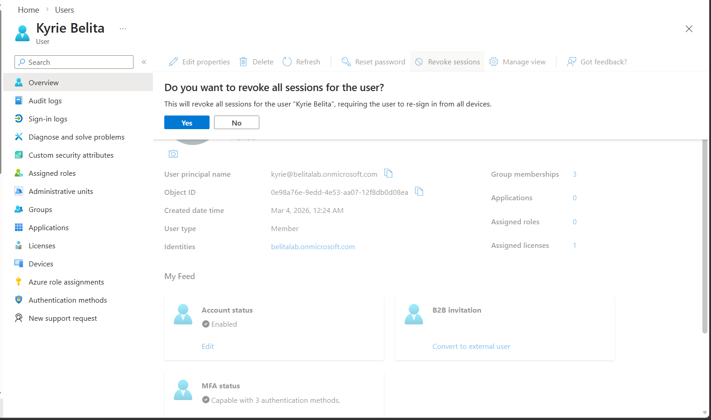
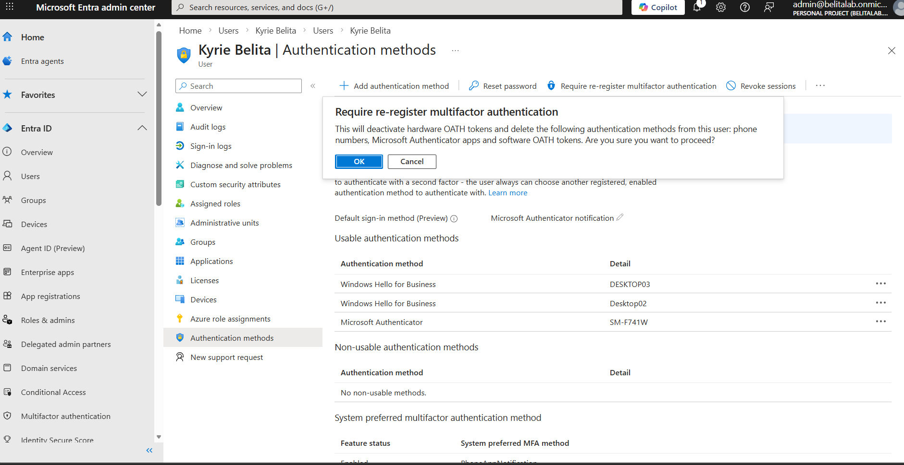
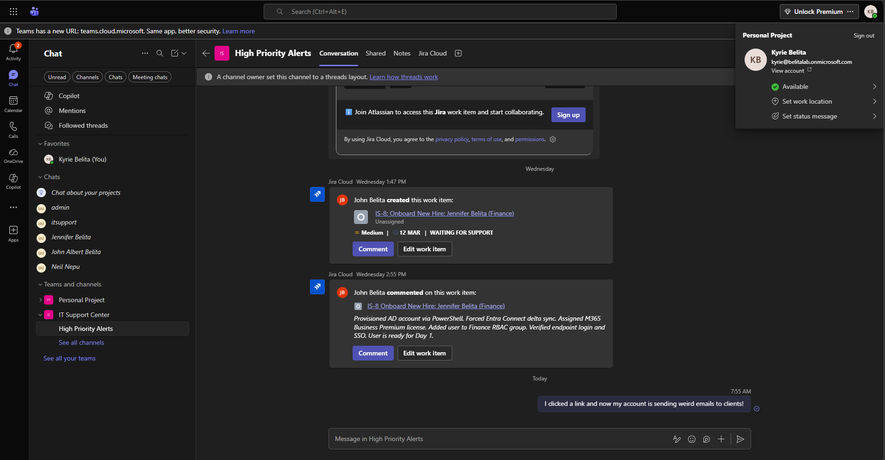
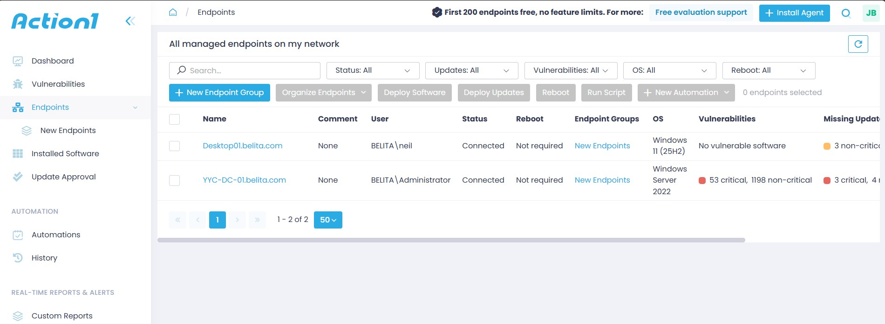

# 🚒 IT Service Management & Incident Response

**Administrator:** John Belita  
**Location:** Calgary, AB | **Email:** johnalbertbelita@gmail.com  
**Certifications:** CompTIA Security+ (2026)

> 🚨 **PORTFOLIO DIRECTORY:** For a more streamlined review experience, the core components of this enterprise lab have been separated into two specialized repositories. Please select the portfolio most relevant to the role you are evaluating:
> 
> 🏗️ **[1. Hybrid Enterprise Infrastructure (The "Build")](https://github.com/chingilik/hybrid-enterprise-infrastructure)**
> *For Systems Administration roles. Documents the architecture, automated deployment (WDS/Intune), and security hardening of the hybrid cloud environment.*
> 
> 🚒 **[2. Enterprise Incident Management (The "Support")](https://github.com/chingilik/enterprise-incident-management)**
> *For Service Desk & MSP Support roles. Documents Tier 1/Tier 2 incident resolution, Jira ITSM workflows, SLAs, and Action1 RMM patch management.*

---

## 🚀 Project Overview
While building infrastructure demonstrates architectural knowledge, the core of IT Operations is Incident Response and Root Cause Analysis (RCA). This portfolio simulates a high-volume Service Desk escalation queue. It documents the intake, investigation, and resolution of complex, real-world IT incidents spanning hybrid identity, endpoint security, and M365 administration.

### 🛠️ ITSM Tech Stack & Tools
* **Ticketing & ChatOps:** Jira Service Management, Microsoft Teams (Webhooks)
* **RMM & Patching:** Action1 RMM
* **Remote Management:** Microsoft Intune (Autopilot Reset), Administrative Shares (C$)
* **Admin Centers:** Microsoft 365 Admin Center, Exchange Admin Center, Microsoft Entra Admin Center

---

## 🎫 1. ITSM & ChatOps (Jira + Teams Integration)
*Managing the incident lifecycle and reducing MTTA (Mean Time To Acknowledge).*

* **SLA Engineering:** Engineered custom Jira SLAs (15m Response / 2h Resolution). Utilized JQL to properly prioritize critical incidents, assigning tickets to appropriate queues.

> **Figure 1.1: SLA Management** - Triaging high-priority incidents in Jira Service Management, acknowledging requests, and actively monitoring SLA countdown timers to ensure contract adherence.

* **Identity Synchronization:** Synced on-premise Active Directory users into the ITSM database to track historical requests via a customized Customer Portal.

> **Figure 1.2: Directory Synchronization** - Managing identity synchronization between on-premise Active Directory and the Jira ITSM platform for accurate end-user tracking.

* **Teams ChatOps Integration:** Integrated Jira with Microsoft Teams via Webhooks, enabling end-users to generate IT tickets directly from chat messages, significantly reducing "shadow IT" requests.

> **Figure 1.3: ChatOps Ticket Generation** - Empowering end-users to generate formatted Helpdesk tickets directly from Microsoft Teams (Top), automatically triggering Webhook alerts to the IT channel (Bottom).

---

## 🛠️ 2. Tier 1 & Tier 2 Service Desk Resolution (Break/Fix)
*Execution of the most frequent support requests encountered in an MSP/Enterprise environment.*

### Ticket 1: The "New Phone" Lockout (Entra ID MFA Reset)
* **Scenario:** User lost access to their Authenticator app after replacing their mobile device.
* **Resolution:** Navigated to Entra ID Authentication Methods, executed **Require re-register MFA**, and revoked active sessions to secure the account during the device transition.

> **Figure 2.1: Identity Access Recovery** - Tracking and resolving the MFA reset incident within the ITSM portal.

### Ticket 2: Secure Offboarding (Mailbox Conversion)
* **Scenario:** Immediate termination of an employee requiring access revocation and data retention.
* **Resolution:** Disabled the AD account, forced an Entra Connect Delta Sync, and converted the Exchange Online inbox to a **Shared Mailbox** to retain historical data while successfully reclaiming the paid M365 Business Premium license.

> **Figure 2.2: Secure Employee Offboarding** - Documenting the offboarding workflow (Top) and configuring the Shared Mailbox delegation for data retention (Bottom).

### Ticket 3: Data Recovery (SharePoint/OneDrive)
* **Scenario:** User permanently deleted critical files from their OneDrive and emptied the standard local Recycle Bin.
* **Resolution:** Generated an administrative access link to the user's environment and successfully recovered the hard-deleted files directly from the hidden **Second-Stage Recycle Bin**.

> **Figure 2.3: Cloud Data Recovery** - Logging the incident and executing the OneDrive administrative recovery workflow to restore business-critical data.

### Ticket 4: Account Lockout (Active Directory)
* **Scenario:** User triggered the domain brute-force protection policy resulting in a hard account lockout.
* **Resolution:** Verified the lockout status client-side, investigated the AD account status, and performed an administrative unlock within Active Directory Users and Computers (ADUC).

> **Figure 2.4: Active Directory Administration** - Validating the lockout trigger at the client endpoint (Top) and executing the administrative override in ADUC (Bottom).

### Ticket 5: Mail Flow Routing (Exchange Trace)
* **Scenario:** User reported a critical missing email from an external vendor.
* **Resolution:** Executed a Message Trace within the Exchange Admin Center to track inbound email traffic, verifying network routing success and identifying Microsoft 365 spam filter (EOP) handling.

> **Figure 2.5: Mail Flow Diagnostics** - Utilizing the Exchange Message Trace utility to perform root-cause analysis on inbound/outbound email routing failures.

### Ticket 6: Security Incident - Compromised Account Response (P1 Critical)
* **Intake:** ChatOps Escalation. End-user (Kyrie Belita) urgently messaged the **IT Support Center** channel in Microsoft Teams stating: *"I clicked a FedEx link and now my account is sending spam!"* The Teams-to-Jira Webhook automatically ingested the chat and generated a Priority 1 incident.
* **Resolution & Containment:** 1. Acknowledged the Jira ticket via Teams integration, notifying the user that active containment was underway.
  2. Navigated to Microsoft Entra ID and executed **Revoke Sessions** to instantly sever the threat actor's active connection across all devices.
  3. *Hybrid Identity Constraint Bypass:* Due to Password Writeback limitations, executed an administrative password reset directly within on-premise **Active Directory (ADUC)** and forced a Delta Sync (`Start-ADSyncSyncCycle`) to push the new credential hash to Entra ID. 
  4. Executed **Require re-register MFA** to ensure the compromised device was permanently purged from the authentication loop.
  5. **Root Cause Audit:** Accessed the Exchange Admin Center to audit Kyrie's **Mail flow / Forwarding** rules. Discovered and deleted a hidden forwarding rule named `...` designed to silently exfiltrate data.
  6. **ITSM Closure:** Updated the Jira ticket with a full Root Cause Analysis (RCA) and resolved the ticket within SLA.

> **Figure 2.6a: Active Threat Intake via ChatOps** - Utilizing Microsoft Teams to instantly capture a panicked user report, automatically generate a High Priority Jira incident, and communicate immediate containment steps.

> **Figure 2.6b: Active Threat Containment** - Executing critical Zero Trust protocols in Microsoft Entra ID. Instantly revoking all active authentication tokens (Top) and purging the threat actor's device by forcing an MFA re-registration (Bottom).

> **Figure 2.6c: Incident RCA & Audit Trail** - Finalizing the security incident by documenting the Root Cause Analysis (RCA) and hybrid constraint bypass within the Jira Internal Notes for compliance auditing.

---

## 🛡️ 3. Modern Fleet Management & Vulnerability Remediation
*Executing cloud-based vulnerability remediation, automated deployments, and remote support via Action1 RMM.*

* **RMM Dashboard & Visibility:** Synced on-premise assets to the cloud platform to establish real-time endpoint visibility.

> **Figure 3.1: Centralized Endpoint Management** - Utilizing the Action1 RMM dashboard to monitor server and workstation health across the simulated domain.

* **Vulnerability Patching:** Identified critical CVEs and missing updates through automated vulnerability scans. Executed remote patch remediation workflows to secure outdated endpoints.

> **Figure 3.2: Vulnerability Remediation Lifecycle** - Performing automated CVE vulnerability assessments (Top) and executing forced patch management workflows to secure the environment (Bottom).

* **Zero-Touch Software Deployment:** Silently deployed 3rd-party applications to client endpoints without manual intervention via the RMM App Store task automation.

> **Figure 3.3: Silent Application Deployment** - Architecting a zero-touch deployment task to push third-party software (7-Zip) to remote endpoints without interrupting user productivity.

* **Remote Administration (Hidden Shares):** Utilized administrative network shares (C$) to remotely access and troubleshoot client file systems over the network.

> **Figure 3.4: Remote Diagnostics** - Utilizing built-in Windows administrative shares (C$) to securely access client file systems in the background.

---

## 🎓 4. Capstone Workflow: End-to-End Employee Onboarding
*Unifying ITSM, AD DS, Entra ID, M365, and Intune into a single operational pipeline.*

1. **Intake:** Generated a New Hire Request in Jira Service Management.
2. **Identity:** Utilized a custom PowerShell script to automatically build the AD account, assign it to an RBAC security group, and enforce a temporary password.
3. **Cloud Sync:** Executed a forced Delta Sync (`Start-ADSyncSyncCycle`) to immediately push the identity to Entra ID.
4. **Licensing:** Assigned an M365 Business Premium license via the cloud admin center to provision Exchange Online.
5. **Closure:** Documented the technical steps in the Jira internal notes and resolved the ticket within SLA limits.

> **Figure 4.1: The Capstone Resolution** - The completed onboarding pipeline, demonstrating seamless integration between ticketing, local Active Directory provisioning, and Microsoft 365 licensing.
